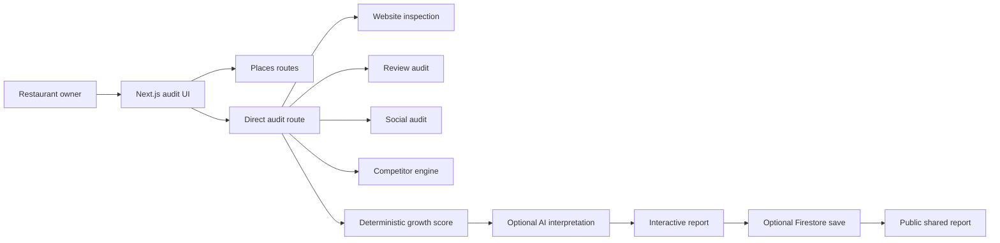

# Growth Audit Project Knowledge Base

> [!summary]
> Growth Audit is a Next.js application that evaluates a restaurant's public growth engine: discovery, direct ordering, reputation, retention, engagement, and measurement readiness.

This directory is an Obsidian-compatible knowledge base for the complete project. Start with [[01-Project/Project Overview|Project Overview]], then follow the maps of content below.

## Maps of content

- [[01-Project/Project Overview|Project Overview]] — product, audience, capabilities, and boundaries
- [[02-Architecture/Architecture Overview|Architecture Overview]] — system shape, components, and execution model
- [[03-Workflows/Audit Workflow|Audit Workflow]] — end-to-end user and audit lifecycle
- [[03-Workflows/Review Theme Intelligence|Review Theme Intelligence]] — approved rules for meaningful review themes
- [[03-Workflows/GMB Asset Gap Discovery|GMB Asset Gap Discovery]] — verified brand discovery and Google-profile gap rules
- [[04-Modules/Module Index|Module Index]] — every application and library module
- [[05-APIs/API Index|API Index]] — internal HTTP contracts
- [[06-Data/Data Model|Data Model]] — request, evidence, result, and persistence structures
- [[07-Integrations/Integration Index|Integration Index]] — external providers and degradation behavior
- [[07-Integrations/GA4 Analytics|GA4 Analytics]] — anonymous audit-funnel measurement and privacy rules
- [[08-Operations/Local Development|Local Development]] — installation, configuration, and commands
- [[08-Operations/Deployment|Deployment]] — Vercel deployment architecture and procedure
- [[08-Operations/Security and Reliability|Security and Reliability]] — controls, privacy, limits, and operational risks
- [[09-Reference/Environment Variables|Environment Variables]] — complete runtime configuration catalogue
- [[09-Reference/Glossary|Glossary]] — domain terminology

## System at a glance

## Documentation conventions

- Notes use YAML frontmatter, standard Markdown, Obsidian callouts, wiki-style internal links, and Mermaid.
- `source` in frontmatter points to the implementing repository file.
- A **map of content** (`moc`) is a navigation page, not an implementation module.
- Facts in this vault describe the code on branch `feature/my-update` when generated.
- Existing root-level specifications remain source material; this vault provides the navigable canonical structure.

## Repository boundaries

The application is a single deployable Next.js repository. The competitor engine is internal at `/api/places/competitors`; it is not a required second service. Google, review, social, AI, persistence, and CRM providers remain external and are configured through environment variables.

## Related notes

- [[01-Project/Repository Map|Repository Map]]
- [[02-Architecture/Design Principles|Design Principles]]
- [[08-Operations/Documentation Maintenance|Documentation Maintenance]]
