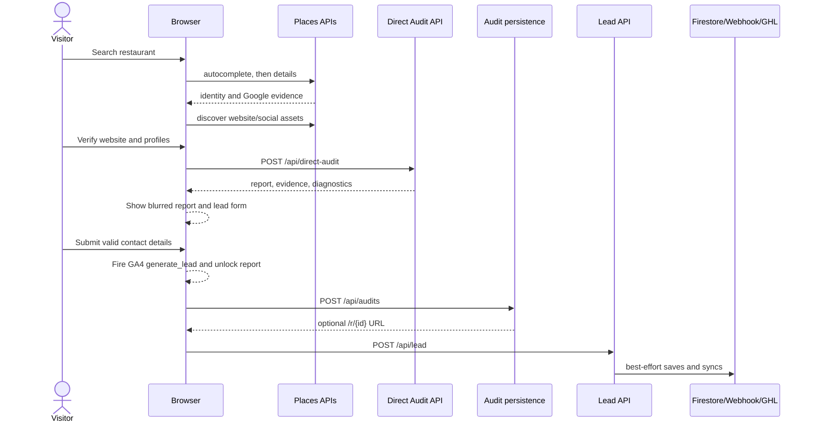
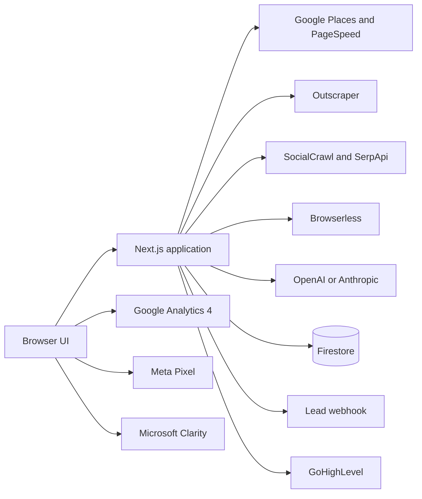

# Engineering Handover

> [!important]
> This is the starting document for an engineer taking ownership of Growth
> Audit. It describes repository `main` at commit `27e5952` on 2026-09-22.
> Analytics settings in GA4, Meta Events Manager, Microsoft Clarity, Vercel,
> Firebase, GoHighLevel, and any webhook are external state and must be verified
> in those systems before changing code.

## 1. What the product is

Growth Audit is a public lead-generation and diagnostic application for
restaurant owners and operators. A visitor selects a restaurant, confirms its
website and social profiles, runs an audit built from public evidence, and then
submits contact details to view the completed report.

The product is not a private business-intelligence connector. It cannot see a
restaurant's private sales, CRM, advertising, loyalty, or analytics data. It
uses publicly observable evidence to identify likely gaps in five parts of the
restaurant growth engine:

| Pillar | Weight | Business question |
|---|---:|---|
| Website + Ordering | 25 | Can a customer buy directly and easily? |
| Reputation + Local Presence | 25 | Does the restaurant earn trust locally? |
| Customer Retention | 20 | Is there a visible path to another visit? |
| Customer Engagement | 15 | Is the restaurant staying connected? |
| Measurement + Growth | 15 | Is public measurement infrastructure present? |

The score is deterministic. Optional AI translates evidence into owner-facing
language but must not recalculate or contradict the score. Unknown evidence
reduces coverage instead of automatically becoming a zero. Coverage below 85%
makes the result provisional.

## 2. User journey and system actions



Important ordering details:

1. The real audit runs before contact details are requested.
2. `audit_completed` means the audit API returned successfully; it does not
   mean a lead exists.
3. After client-side validation, the report unlocks immediately and GA4
   `generate_lead` fires before audit persistence or lead delivery succeeds.
4. The client attempts `/api/audits` first so it can include a share URL in the
   final `/api/lead` request.
5. Persistence, webhook delivery, and CRM upsert are deliberately best-effort.
   The visitor can see the report even if one or all of them fail.

## 3. Architecture

The project is one Next.js 16 application intended for Vercel. It contains
client-rendered search/audit/report flows, Node.js route handlers, a
server-rendered shared-report route, deterministic domain libraries, and
optional providers.



Primary control points:

| Area | Source |
|---|---|
| Root scripts and metadata | `app/layout.tsx` |
| Main browser workflow | `app/page.tsx` |
| Report UI | `components/audit-report.tsx` |
| Audit orchestration | `app/api/direct-audit/route.ts` |
| Scoring | `lib/growthEngine.ts` |
| Website inspection | `lib/audit.ts` |
| Reviews | `lib/reviewAudit.ts` |
| Social discovery/audit | `lib/social.ts` |
| Competitor benchmark | `lib/competitorBenchmark.ts` and related modules |
| Lead delivery | `app/api/lead/route.ts`, `lib/ghl.ts`, `lib/auditEmail.ts` |
| Persistence | `app/api/audits/route.ts`, `lib/firebase.ts` |
| Analytics helper | `lib/analytics.ts` |

## 4. Evidence collection and report creation

### Restaurant discovery

The browser debounces search by 350 ms. When browser coordinates are available,
autocomplete first searches within 50 km and sorts returned distance data
nearest-first. If that returns no results, it retries worldwide. Selecting a
restaurant loads Google identity, address, coordinates, website, category,
rating, review count, price level, hours, and a small review sample.

### Website and brand assets

The system reads the Google-linked website, extracts recognized social links,
and can use SerpApi to find a missing brand website or missing Instagram,
Facebook, and TikTok profiles. Independently discovered assets retain their
source and verification state; they must not be represented as if they came
from Google Business Profile.

Website confirmation is required. Social URLs are editable and optional.

### Audit execution

`POST /api/direct-audit` first fetches and inspects up to 1.5 MB of website HTML.
After that, PageSpeed, social, reviews, and competitor work run concurrently.
Each phase catches its own failure and returns degraded evidence rather than
normally failing the whole report.

The audit can evaluate:

- website reachability, security, metadata, headings, schema, links, assets,
  performance signals, customer paths, ordering paths, and public tracking;
- mobile and desktop PageSpeed evidence;
- Google reputation baseline and a bounded recent-review corpus from
  Outscraper when configured;
- owner response behavior, rating-backed sentiment, and repeated review topics;
- public social profiles, posting activity, and engagement when evidence meets
  reliability thresholds;
- nearby competitors and local context;
- visible retention paths such as loyalty, accounts, email, SMS, WhatsApp, and
  direct ordering;
- public measurement technology such as GA4, GTM, advertising pixels, and
  related tags.

The response contains normalized restaurant data, website evidence,
deterministic `result`, owner-facing `interpretation`, reviews, social evidence,
benchmark data, and provider diagnostics.

### AI boundary

AI is optional and provider-neutral. OpenAI or Anthropic can produce concise
owner-facing interpretation from compact deterministic evidence. Invalid,
failed, timed-out, or unconfigured model calls fall back to deterministic copy.
Never move scoring authority into the model.

## 5. Application routes

| Method | Route | Responsibility | Failure behavior |
|---|---|---|---|
| GET | `/` | Landing, search, confirmation, audit, lead form, live report | Client errors shown locally |
| GET | `/direct-audit` | Alternate entry to the same experience | Same as `/` |
| GET | `/r/{id}` | Server-rendered public saved report | 404 if unavailable |
| GET | `/api/places/autocomplete` | Restaurant predictions | 502/503 with safe message |
| GET | `/api/places/details` | Selected Google location evidence | 502/503 with safe message |
| GET | `/api/social/discover` | Website and official-profile discovery | Degraded discovery result |
| GET | `/api/social/check` | SocialCrawl operational diagnostics | Diagnostic error response |
| POST | `/api/direct-audit` | Complete audit orchestration | Independent phases degrade; fatal errors return JSON error |
| GET | `/api/places/competitors` | Competitor engine | Error or fallback in caller |
| POST | `/api/audits` | Optional report persistence | Soft success if Firebase is absent; 500 on configured write failure |
| GET | `/api/audits/{id}` | Public report projection | Omits lead; 404 when unavailable |
| POST | `/api/lead` | Lead storage, webhook, and GHL sync | Side-effect failures are logged and normally still return `{ok:true}` |

## 6. Lead lifecycle and definitions

The lead form requires a name, syntactically valid email, and a phone number
valid for the selected country. `libphonenumber-js` converts the number to an
international form before submission.

After validation, the browser creates a `submissionId`, unlocks the report, and
starts this asynchronous sequence:

1. `POST /api/audits` with the business, audit, and lead.
2. If Firestore is configured, create `audits/aud_{id}` and return the canonical
   `https://growthaudit.tossdown.com/r/{id}` URL.
3. If a URL is returned, update browser history and fire GA4 `report_shared`.
4. `POST /api/lead` once with contact data, restaurant profile, report URL when
   available, score summary, top gaps, and email-template inputs.
5. `/api/lead` independently attempts Firestore lead storage, webhook delivery,
   and GoHighLevel upsert.

There is no single current metric that proves an end-to-end delivered lead:

| Signal | What it actually proves |
|---|---|
| Form accepted by browser | Client validation passed |
| GA4 `generate_lead` | A valid form invoked the unlock function |
| Meta `Lead` | The external Meta rule fired; success semantics must be audited |
| `/api/audits` success | Report persistence succeeded, or Firebase was absent and returned a soft success |
| `/api/lead` HTTP 200 | Request passed route validation; downstream side effects may still have failed |
| Firestore `leads/{submissionId}` | Lead was durably stored in Firestore |
| GoHighLevel contact | CRM upsert succeeded |
| Webhook receipt | Downstream webhook accepted the request |

Because downstream failures are deliberately swallowed, engineering and
marketing dashboards must not treat GA4, Meta, HTTP 200, Firestore, webhook,
and GHL counts as interchangeable.

## 7. GA4 configuration and events

GA4 is rendered only when `NEXT_PUBLIC_GA_MEASUREMENT_ID` matches `G-...`.
Both the library and initialization script use Next.js `lazyOnload`. Calls made
before `window.gtag` exists are currently no-ops; the helper does not maintain
its own pre-load queue.

No event is allowed to include lead PII, full address, place ID, report ID, or
URL.

| Event | Exact code trigger | Parameters | Meaning and caveat |
|---|---|---|---|
| `restaurant_selected` | Place details load, before asset discovery finishes | `restaurant_category`, `has_google_website` | A Google location was selected |
| `audit_started` | Visitor verifies details and begins the audit | `restaurant_category`, `has_website`, `social_profile_count` | Audit request is about to start; this is not a lead-form event |
| `audit_completed` | `/api/direct-audit` returns success | `growth_score`, `evidence_coverage` | Report data exists in browser memory |
| `generate_lead` | Valid lead form invokes `unlock` | `restaurant_category` | Form validation passed; persistence/CRM success is not confirmed |
| `report_shared` | `/api/audits` returns a URL | `growth_score` | A persistent report URL was returned |

`generate_lead` is the intended GA4 key-event candidate, but its present name
describes a UI milestone rather than confirmed backend delivery.

## 8. Meta Pixel configuration and events

The repository hardcodes Meta Pixel ID `2061786917743035` in
`app/layout.tsx`. It loads the base pixel with `lazyOnload` and explicitly sends
only:

```text
fbq('init', '2061786917743035')
fbq('track', 'PageView')
```

There is also a no-script `PageView` image. The repository contains no explicit
`fbq('track', 'Lead')` call and no Conversions API implementation.

On 2026-09-22, Meta's Test Events panel was observed receiving `PageView`,
`Lead`, and repeated `SubscribedButtonClick` events for the production domain.
This proves that Meta receives a Lead event, but the `Lead` and
`SubscribedButtonClick` behavior is not defined in this repository. It is most
likely controlled through Meta's Event Setup Tool or automatic event detection;
the exact external rule still needs to be inspected in Events Manager.

Do not assume the observed Meta `Lead` equals a stored lead. Test the rule with:

1. an invalid form submission, which must not produce `Lead`;
2. a valid form submission where `/api/lead` fails, to establish current
   failure semantics;
3. a valid submission where Firestore/GHL/webhook success is confirmed;
4. one full journey while watching Test Events, ensuring exactly one `Lead`.

See [[07-Integrations/Meta Pixel|Meta Pixel]] for the maintained contract.

## 9. Microsoft Clarity

Clarity loads only when both conditions are true at build time:

- `NEXT_PUBLIC_CLARITY_PROJECT_ID` is present and alphanumeric; and
- `NEXT_PUBLIC_ENABLE_CLARITY` is exactly `true`.

It uses `lazyOnload`. The application sends no custom user, CRM, lead, or report
properties. If the enable flag is missing, Clarity renders nothing even when
the project ID is correct. Changing either public variable requires a redeploy.

## 10. Persistence and external delivery

### Firestore

All three Firebase Admin variables must exist. The app stores:

- `audits/{auditId}`: business, scores, full report, private lead, timestamp;
- `leads/{submissionId}`: normalized lead, business profile, report summary,
  optional report URL, source, and capture timestamp.

The public report API explicitly removes `lead` before returning an audit.

### GoHighLevel

When `GHL_PIT_TOKEN` and `GHL_LOCATION_ID` exist, the lead route upserts a
contact and maps audit/business fields. Failures are logged and ignored by the
browser response.

### Lead webhook

When `LEAD_WEBHOOK_URL` exists, the route posts a JSON payload. If a canonical
report URL exists, it can also include a rendered email with HTML, text, and
subject. Failures are logged and ignored.

### Optional submit secret

Do not set `LEAD_SUBMIT_SECRET` for the current direct browser flow. The browser
does not send `x-submit-secret`, so enabling it would make every normal lead
request return 403 unless an intermediary is added.

## 11. Environment variables

| Group | Variables |
|---|---|
| Core | `GOOGLE_PLACES_API_KEY` |
| Optional evidence | `GOOGLE_MAPS_API_KEY`, `OUTSCRAPER_API_KEY`, `SOCIALCRAWL_API_KEY`, `SERPAPI_API_KEY`, `BROWSERLESS_TOKEN` |
| AI | `AI_PROVIDER`, `AI_API_KEY`, `AI_MODEL`, `OPENAI_API_KEY`, `ANTHROPIC_API_KEY`, `DIRECT_AUDIT_AI_MODEL` |
| URLs/security | `NEXT_PUBLIC_BASE_URL`, `COMPETITOR_ENGINE_URL`, `VERCEL_URL`, `ALLOWED_ORIGINS` |
| Browser analytics | `NEXT_PUBLIC_GA_MEASUREMENT_ID`, `NEXT_PUBLIC_CLARITY_PROJECT_ID`, `NEXT_PUBLIC_ENABLE_CLARITY` |
| Firestore | `FIREBASE_PROJECT_ID`, `FIREBASE_CLIENT_EMAIL`, `FIREBASE_PRIVATE_KEY` |
| Lead delivery | `GHL_PIT_TOKEN`, `GHL_LOCATION_ID`, `LEAD_WEBHOOK_URL`, `LEAD_SUBMIT_SECRET` |

Public variables are embedded at build time. Vercel Development, Preview, and
Production values are separate. See [[09-Reference/Environment Variables|Environment Variables]]
for meanings and constraints.

## 12. Local development and validation

Use the package manager intentionally. `package.json` declares pnpm, while both
`pnpm-lock.yaml` and `package-lock.json` exist. Avoid changing both lockfiles
accidentally.

```bash
npm ci
npm run dev
npm run typecheck
npx next build --webpack
```

There are currently no `lint` or automated `test` scripts in `package.json`.
The default `next build` uses Turbopack; webpack is a useful independent build
path and is known to work in restricted environments where Turbopack cannot
bind an internal port.

Before writing Next.js code, read the relevant Next.js 16 documentation in
`node_modules/next/dist/docs/` as required by `AGENTS.md`.

Minimum smoke test:

1. Search and select a known restaurant.
2. Verify location, website, and discovered social profiles.
3. Run an audit and inspect `/api/direct-audit` diagnostics.
4. Confirm all five pillars and evidence coverage render.
5. Submit an invalid lead and confirm no conversion event or backend request.
6. Submit a valid lead while watching browser Console and Network.
7. Confirm GA4 DebugView events and parameters contain no PII.
8. Confirm Meta Test Events fires one intended `Lead`, not merely a button click.
9. Confirm `/api/audits` and `/api/lead` responses.
10. Confirm the Firestore/GHL/webhook record expected for the test.
11. Open `/r/{id}` privately and confirm it contains no lead data.
12. Confirm a Clarity session appears only when intentionally enabled.

## 13. Deployment and release

The intended release flow is feature branch → reviewed pull request → `main` →
Vercel build → production smoke test. Do not push directly to `main`, merge, or
deploy without explicit approval.

The main audit and competitor route declare long serverless durations. Provider
latency and the internal competitor self-call make timeouts a real operational
risk. Verify the Vercel plan supports the configured duration.

After changing any `NEXT_PUBLIC_` variable, redeploy because the value is
embedded into the browser bundle.

## 14. Known risks and current investigation priorities

1. **Conversion metrics do not share one definition.** GA4 `generate_lead`,
   Meta `Lead`, Firestore records, webhook receipts, and GHL contacts can differ.
2. **Meta conversion logic is external and unversioned.** The observed Lead
   event is not emitted by repository code and may be button-based.
3. **Clarity has an extra enable gate.** A valid project ID alone does nothing.
4. **Lazy analytics can miss early events.** GA4 calls are no-ops until `gtag`
   exists; Meta and Clarity also load lazily.
5. **The UI unlocks before backend confirmation.** A visitor can see a report
   even when lead delivery fails.
6. **`/api/lead` success is not delivery confirmation.** Downstream errors are
   intentionally swallowed.
7. **Client persistence hides errors.** The browser catches failures without a
   visible retry or operational status.
8. **No consent implementation is present.** GA4, Meta, and Clarity require a
   jurisdiction-appropriate consent and disclosure review.
9. **Rate limiting is in-memory.** It is not durable across serverless instances.
10. **Outbound URL fetching lacks a documented centralized private-network
    denial layer.** Treat SSRF hardening as security work.
11. **Dependency versions include `latest`.** Lockfiles currently protect the
    installed graph, but updates require careful review.
12. **Middleware convention is deprecated in current Next.js.** Migration to
    `proxy` should be handled as a separate reviewed change.

## 15. Troubleshooting the submit and measurement flow

When a submit appears broken, collect one correlated test rather than comparing
dashboard totals:

1. Record the time, browser, campaign URL, restaurant, and test email.
2. In DevTools, preserve the Network log.
3. Confirm the form does not show a client validation error.
4. Inspect `/api/audits` status and response.
5. Inspect `/api/lead` status and response.
6. Check Console errors from application and tracking scripts.
7. Check Vercel logs for `audits`, `lead`, Firebase, webhook, and GHL messages.
8. Check Firestore by `submissionId` and audit ID.
9. Check GHL/webhook delivery.
10. Compare the same timestamp in GA4 DebugView, Meta Test Events, and Clarity.

The target future contract should define one canonical successful-lead event
after durable backend acceptance, use an idempotent identifier across systems,
and make browser analytics secondary copies of that state. That change requires
an approved design because it affects marketing attribution, privacy, CRM
delivery, and user experience.

## 16. Change protocol for the incoming engineer

1. Start with this handover and `docs/00-Home.md`.
2. Reproduce the current behavior before editing it.
3. Distinguish repository code from Vercel and vendor-dashboard configuration.
4. Update the relevant Markdown contract before implementation.
5. Work on a feature branch.
6. Keep deterministic scoring separate from AI interpretation.
7. Preserve graceful degradation unless a deliberately stricter contract is
   reviewed.
8. Never send lead PII to GA4, Meta event parameters, or Clarity custom data.
9. Validate type-check, production build, full browser flow, provider
   diagnostics, analytics, persistence, and privacy projection.
10. Document the exact branch, commit, push, deployment, environment, and
    dashboard changes in the handoff.

## Related notes

- [[01-Project/Project Overview|Project Overview]]
- [[02-Architecture/Architecture Overview|Architecture Overview]]
- [[03-Workflows/Audit Workflow|Audit Workflow]]
- [[05-APIs/API Index|API Index]]
- [[06-Data/Data Model|Data Model]]
- [[07-Integrations/GA4 Analytics|GA4 Analytics]]
- [[07-Integrations/Meta Pixel|Meta Pixel]]
- [[07-Integrations/Microsoft Clarity|Microsoft Clarity]]
- [[08-Operations/Deployment|Deployment]]
- [[08-Operations/Security and Reliability|Security and Reliability]]
- [[09-Reference/Environment Variables|Environment Variables]]
