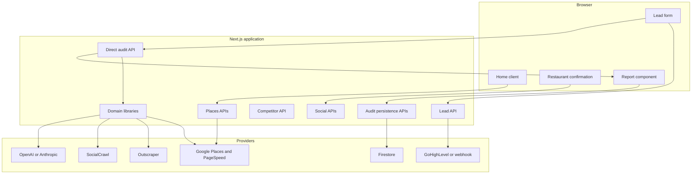

# Architecture Overview

## Architectural style

Growth Audit is a single Next.js application with browser-rendered client experiences, server-rendered shared reports, Node.js route handlers, internal domain libraries, and optional third-party integrations. Vercel is the intended runtime.

## Request execution

The browser first uses small GET endpoints for restaurant identity and social discovery. The expensive work happens in `POST /api/direct-audit`, configured for the Node.js runtime and a 120-second maximum duration.

After initial website HTML retrieval, the route starts PageSpeed, social, review, and competitor phases concurrently. Each phase catches its own failure and returns an honest degraded shape. The deterministic scorer consumes the available evidence, after which the optional AI provider creates owner-facing prose.

## Rendering model

- `/` and `/direct-audit` use a client component for search, confirmation, lead capture, progress, and the live result.
- `/r/[id]` is dynamically server-rendered. It fetches the public audit payload and generates restaurant-specific metadata.
- The report itself is a shared client component used by both the live and persisted paths.

## Persistence model

Firestore is optional. A completed audit is displayed regardless of persistence success. When configured, the application stores the audit plus private lead data and returns a short `/r/{id}` URL. The public GET route intentionally omits the lead.

## Internal self-call

The benchmark module invokes the built-in competitor route through an absolute HTTP URL. Resolution order is:

1. `COMPETITOR_ENGINE_URL`
2. `NEXT_PUBLIC_BASE_URL`
3. `VERCEL_URL`
4. `http://localhost:3000`

## Related notes

- [[02-Architecture/Design Principles|Design Principles]]
- [[03-Workflows/Audit Workflow|Audit Workflow]]
- [[06-Data/Data Model|Data Model]]
