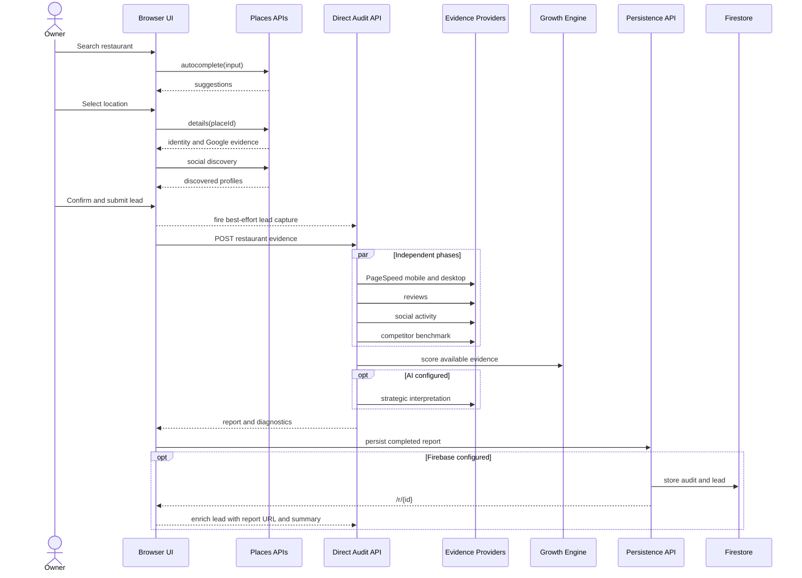

# Audit Workflow

## End-to-end sequence

## Phase details

### 1. Restaurant discovery

The client waits 350 ms after typing and searches when the trimmed query has at least three characters. The suggestion list is bounded, scrollable, and may escape its decorative hero container so it is never clipped or obscures the selection flow on smaller screens. Selecting a suggestion requests Google fields for identity, coordinates, website, reputation, opening hours, price, category, and a small review sample.

### 2. Brand-asset and social discovery

The Google-linked website is fetched and parsed for recognized social URLs. When Google has no website, the application may search Google results through SerpApi using the restaurant name and locality, then use a bounded brand-only fallback query for chain-level sites/accounts that do not publish branch location text. A multi-location brand website may be verified using brand/title evidence plus city-level evidence; an individual branch’s full street address is not required on the chain’s central website. Missing Instagram, Facebook, or TikTok profiles may be searched with platform-specific Google queries when `SERPAPI_API_KEY` is configured. Brand assets retain their discovery source and verification state so independently found assets are clearly marked as missing from GMB and the website as a customer-relationship gap.

### 3. Lead lifecycle

One `submissionId` is generated in the browser. A first best-effort lead request starts without waiting. After report persistence, a second request with the same ID merges the report URL and a compact summary into the lead record.

### 4. Website inspection

The server fetches up to 1.5 MB of HTML, records reachability and response evidence, then extracts metadata, headings, schema, ordering links, customer paths, social links, tracking technologies, resource counts, opening-hours consistency, and other technical signals. Browserless is an optional fallback.

### 5. Concurrent evidence phases

- PageSpeed: mobile and desktop Lighthouse/API evidence
- Reviews: bounded Outscraper recent-review corpus, response data, star-rating sentiment, and deterministic product/service topic map; Google fallback remains baseline-only
- Social: SocialCrawl activity and engagement normalization; every confirmed official profile is shown, while activity conclusions require a reliable sample
- Competitors: internal V3 engine, then a clearly-labelled Google Places local-reference fallback when the V3 engine cannot produce an eligible set; focused concepts apply a strict product/type gate so generic nearby restaurants do not appear as substitutes

### 6. Scoring

Provider-specific scorers normalize social, review response, and sentiment evidence. `scoreGrowthEngine` combines all available signals into five pillars, overall coverage, the score, ordering status, and paid-media readiness.

The review topic map is not a new score input. It is explanatory evidence: repeated customer language is grouped as product, service, experience, or operational topics, each with an evidence-confidence label. This avoids requiring an AI provider merely to show what customers are discussing.

### 7. Interpretation

If a funded AI provider is available, it receives compact evidence and must return JSON. Invalid, missing, timed-out, or failed output falls back to deterministic prose.

### 8. Presentation and persistence

The report renders immediately. It groups findings into owner decisions—growth engine, customer conversion, local market context, customer voice, and technical evidence—rather than exposing provider-oriented sections. Paid-media guidance is excluded from the owner report. Persistence is attempted afterward and is non-fatal. On success, browser history is changed to the share path without reloading.

## Related notes

- [[05-APIs/API Index|API Index]]
- [[06-Data/Data Model|Data Model]]
- [[07-Integrations/Integration Index|Integration Index]]
