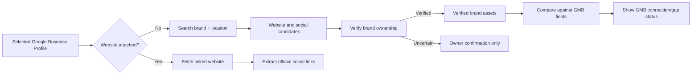

# GMB Asset Gap Discovery

> [!important]
> Google Business Profile (GMB) links and independently discovered brand assets are separate evidence sources. An official asset discovered elsewhere must never be represented as already connected to GMB.

## Goal

When a selected restaurant has no website attached to its Google Business Profile, the audit should search for the restaurant’s authentic brand website and official social profiles. When verified assets are found, the system must prominently identify the missed Google profile opportunity:

> **We found your official website/profile, but it is not linked from your Google Business Profile.**

This applies to:

- restaurant website
- Instagram
- Facebook
- TikTok
- other verified social profiles supported by the application

## Evidence states

Every discovered asset must retain source and verification state.

| State | Meaning | Owner-facing treatment |
|---|---|---|
| `linked_on_gmb` | Present in the selected Google profile | “Connected to Google Business Profile” |
| `verified_brand_asset_missing_from_gmb` | Verified as official, but no Google website/profile connection exists | Highlight as a GMB gap and provide the update action |
| `verified_brand_asset` | Verified official asset; GMB does not provide a comparable field | Show as verified brand asset, not as a GMB failure |
| `candidate_needs_confirmation` | Plausible result but insufficient verification | Ask owner to confirm; do not score or claim ownership |
| `not_found` | No credible asset discovered | “Not found publicly” |

Google Business Profile exposes a website URL but does not reliably expose social profile links in the selected Places response. Therefore:

- A verified brand website with blank GMB website is always a direct GMB gap.
- Verified social profiles are surfaced as brand assets. The report must say that social links are not present on the restaurant website and, where no Google-provided social link exists, avoid falsely claiming Google itself has a dedicated social-link field.
- The actionable GMB recommendation is to add/confirm the official website in the Google profile, because that gives customers an authenticated route to the brand’s owned hub and social links.

## Discovery pipeline



## Verification rules

A discovery result is not authentic merely because it appears in a search result. A website becomes a verified brand asset only when it meets sufficient independent evidence.

### Website verification

Use a weighted match from the candidate website and selected Google business:

| Evidence | Strength |
|---|---:|
| exact or normalized restaurant name in site title, JSON-LD, or visible heading | high |
| selected address/city/phone visibly matches site contact/location data | high |
| website links to social profile whose handle/brand matches restaurant | supporting |
| Google-result title and domain clearly name the restaurant | supporting |
| generic directory, delivery marketplace, review site, or social platform domain | automatic rejection as website |

Require either two high-strength signals, or one high-strength plus two supporting signals. A candidate without enough evidence becomes `candidate_needs_confirmation`.

### Social verification

A social profile becomes verified only when at least one of these is true:

1. It is linked from a verified official website.
2. Its canonical URL/handle is returned by a high-confidence brand search result and its displayed name/bio/domain matches the restaurant.
3. It uses a verified-domain link that points back to the verified restaurant website.

When a core social platform is absent—whether or not a website has been found—the discovery service must run a platform-specific brand search using the restaurant name and city/locality. Do not require an individual branch’s complete address to be present on a chain-level brand profile. A search result is automatically usable only when its platform URL/handle and result title or description form a high-confidence brand match. Its source remains `search`, and the report must state: **Official brand profile found by search — it is not linked on this branch’s website or Google profile.**

Never call a generic hashtag, fan account, branch-inaccurate account, delivery marketplace, or unrelated same-name account official.

## Search strategy

When GMB has no website, query using the restaurant’s name plus locality/address. Search results should prefer likely owned domains and exclude:

- Google Maps and Google search URLs
- DoorDash, Uber Eats, Grubhub, Skip, Deliveroo, Foodpanda, and similar marketplaces
- reservation/review/directory sites
- news/blog mentions
- social URLs as website candidates

If a verified website is found, fetch it and use first-party links, `sameAs` schema, and `rel="me"` links as the preferred source for official social profiles. Search-only social results are lower-confidence fallback candidates.

For each missing core platform, run a dedicated query rather than one broad multi-platform query. Use the city/locality rather than a Plus Code or full street address for social-profile queries, because official chain accounts rarely publish each individual branch address. This prevents a strong Instagram result from hiding an absent Facebook or TikTok result.

### Runtime budget

Website-candidate discovery and platform-specific social searches are independent and must run concurrently. Each external Google-result lookup has a short deadline so the confirmation step returns within the route’s 30-second Vercel budget. Do not run a broad fallback search after those lookups on the critical path; return verified evidence already obtained and let the audit continue.

## Data contract

The discovery endpoint should return a structured asset record rather than bare URLs:

```ts
type BrandAsset = {
  kind: 'website' | 'social'
  platform?: string
  url: string
  source: 'gmb' | 'website' | 'search'
  verification: 'linked_on_gmb' | 'verified_brand_asset_missing_from_gmb' | 'verified_brand_asset' | 'candidate_needs_confirmation'
  confidence: 'limited' | 'medium' | 'high'
  evidence: string[]
}
```

The confirmed restaurant input retains `googleWebsiteUrl` as the original Google value. A separately discovered `websiteUrl` must not overwrite that value.

## UI and reporting requirements

### Confirmation step

- Pre-fill a verified brand website/social profile.
- Add a visible badge: **Found independently — missing from Google Business Profile** when appropriate.
- Require owner confirmation for any candidate that is not verified.

### Audit report

- Report the Google website state independently from website quality.
- If a verified website exists but GMB is blank, state the concrete gap and action: “Add this official website to your Google Business Profile.”
- If GMB links a different domain from the verified brand site, state that the profile points to a different destination.
- Do not reduce score or make a definitive ownership claim for unverified candidates.

## Failure behavior

- Without a configured search provider, do not invent a website; return `not_found`/unavailable discovery evidence.
- If search finds candidates but verification fails, surface them only for owner confirmation.
- If a platform-specific search has high-confidence brand evidence but the website does not link to that profile, use it as a verified search-discovered social asset and flag the missing website connection.
- A website fetch failure after a strong search result should preserve the candidate with reduced confidence, not treat it as verified.
- Provider failures must not block the normal audit flow.

## Acceptance scenarios

### GMB blank; official brand site found

GMB website: blank. Search finds a website with the restaurant name, matching address, and official Instagram link.

Expected:

- Website: `verified_brand_asset_missing_from_gmb`
- Instagram: `verified_brand_asset`
- Confirmation and report prominently recommend adding the website to GMB.

### GMB points to marketplace; official brand site found

GMB website: marketplace. Search finds verified owned domain.

Expected:

- GMB website state: different/non-owned destination
- Brand website: verified
- Recommendation: replace the GMB link with the owned domain.

### Same-name candidate but insufficient proof

Search finds a restaurant with the same name in another city.

Expected:

- `candidate_needs_confirmation` or rejection
- no ownership claim
- no score impact until confirmed

## Implementation order

1. This specification and [[06-Data/Data Model|Data Model]]
2. search, verification, and asset-source logic in `lib/social.ts`
3. structured discovery response in `app/api/social/discover/route.ts`
4. confirmation-state handling in `app/page.tsx`
5. GMB-gap evidence and owner-facing report presentation
6. fixture tests for blank, mismatched, verified, and ambiguous cases

## Related notes

- [[03-Workflows/Audit Workflow|Audit Workflow]]
- [[04-Modules/Evidence Modules|Evidence Modules]]
- [[07-Integrations/Integration Index|Integration Index]]
