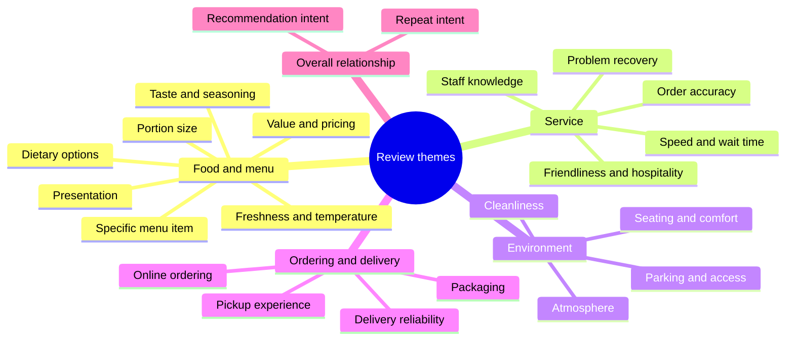

# Review Theme Intelligence

> [!important]
> This note defines the required behavior for review themes. A theme is a restaurant-relevant customer subject with repeated evidence — **not** a frequent word, a grammatical fragment, or a generic adjective.

## Problem this solves

The current word-map approach can display fragments such as “I’m,” “Its,” “Tasted,” “Overall,” or “Experience” as product topics. Those outputs are not useful to a restaurant owner and reduce trust in the audit.

The replacement must answer owner questions such as:

- Which specific dishes or menu items do guests praise or criticize?
- Are food quality, portion size, value, or presentation recurring themes?
- Is service fast, slow, friendly, inaccurate, or unresponsive?
- Are cleanliness, atmosphere, seating, parking, or wait times affecting visits?
- Which negative themes are repeated enough to deserve action?

## Theme contract

A published theme must satisfy all of the following:

1. It represents a meaningful restaurant subject or customer outcome.
2. It is expressed as a canonical noun phrase or defined operational category.
3. It is supported by at least two distinct reviews, unless it is a high-severity issue with direct evidence.
4. Its sentiment is derived from the review context, not merely a keyword’s presence.
5. It is labelled with a truthful confidence level based on sample size, repetition, and extraction quality.
6. Its displayed name is understandable without reading the source review.

Examples of acceptable themes:

| Theme | Category | Why it is useful |
|---|---|---|
| `Crunch Burger` | Specific menu item | Direct product feedback |
| `Chicken biryani` | Specific menu item | Direct product feedback |
| `Burger dryness` | Food quality | Clear customer outcome |
| `Portion size` | Food quality/value | Recurring purchase-value signal |
| `Slow table service` | Service speed | Actionable operations signal |
| `Friendly staff` | Service quality | Meaningful positive service signal |
| `Order accuracy` | Service reliability | Repeatable operational theme |
| `Clean dining area` | Environment | Visit-quality signal |
| `Long wait time` | Experience | Clear friction signal |

Examples that must never be published alone:

| Reject | Reason |
|---|---|
| `I’m`, `Its`, `The`, `They`, `Overall` | Pronouns, determiners, or generic discourse words |
| `Tasted`, `Kept`, `Recommended` | Bare verbs without an object/topic |
| `Experience`, `Food`, `Service` | Overly broad without a qualifier or outcome |
| `Good`, `Tasty`, `Amazing`, `Bad` | Generic adjectives without a subject |
| `Burger` | Too broad unless it is a confirmed named menu item or repeatedly qualified, such as `dry burger` |
| A staff member’s name | Personal identifier, not an operational theme |
| A one-off complaint | Insufficient recurrence, unless high severity |

## Theme taxonomy

Every published theme must have exactly one category and subcategory.

`Food and menu` themes can use dynamic restaurant-specific names. All other categories should use canonical operational labels rather than arbitrary words from customer prose.

## Extraction pipeline

```mermaid
flowchart LR
    Reviews[Normalized reviews] --> Clean[Clean text and remove boilerplate]
    Clean --> Candidates[Extract noun phrases and defined operational patterns]
    Candidates --> Reject[Reject fragments, names, generic terms, and bare adjectives]
    Reject --> Canonicalize[Canonicalize synonyms and menu-item variants]
    Canonicalize --> Cluster[Cluster equivalent mentions across reviews]
    Cluster --> Context[Assign sentiment from review/context]
    Context --> Threshold[Apply recurrence and confidence rules]
    Threshold --> Rank[Rank actionable themes]
    Rank --> UI[Owner-facing theme cards]
```

### 1. Clean and preserve context

- Normalize punctuation, casing, spelling variants, and repeated whitespace.
- Preserve sentence boundaries, star rating, review date, and owner-response information.
- Remove review boilerplate, pronouns, stop words, generic praise, branch identifiers, and personal names from candidate labels.
- Do not discard the original review text; it is needed for excerpts and auditability.

### 2. Extract candidates, not words

The extractor must seek these forms:

- specific menu-item noun phrases: `wrap monster`, `crunch burger`, `chicken biryani`
- food/outcome patterns: `burger was dry`, `cold fries`, `large portions`, `fresh ingredients`
- service/outcome patterns: `slow service`, `friendly staff`, `wrong order`, `long wait`
- environment/outcome patterns: `clean dining area`, `loud music`, `limited parking`
- ordering/outcome patterns: `late delivery`, `damaged packaging`, `easy online ordering`

It must not emit individual tokens as a theme unless the token is a verified, restaurant-specific menu item and repeats across independent reviews.

The initial deterministic implementation must use a closed set of restaurant outcomes (for example `Slow service`, `Food temperature`, `Order accuracy`, `Value for money`) plus qualified product outcomes (for example `Burger dryness`). It must return no theme rather than falling back to a raw word when a sentence cannot be classified safely.

### 3. Canonicalize before counting

Different wording for the same subject must merge into one owner-readable theme:

| Raw mentions | Canonical theme |
|---|---|
| `waited 30 minutes`, `service took forever`, `slow to serve` | `Slow table service` |
| `burger was dry`, `dry patty`, `not juicy` | `Burger dryness` |
| `staff was kind`, `friendly team`, `helpful server` | `Friendly staff` |
| `large serving`, `huge portions`, `good portion size` | `Generous portions` |
| `cold fries`, `food arrived cold`, `not hot` | `Food temperature` |

Specific menu names must be normalized for casing, plurals, and harmless modifier variation, but not merged with a different dish merely because both are burgers, wraps, or pizza.

### 4. Sentiment must be contextual

A review’s star rating is evidence, but not sufficient by itself for individual themes. Theme sentiment should use:

1. the sentence/clause describing the candidate,
2. explicit positive or negative outcome language around it,
3. review star rating as a confidence-weighted fallback,
4. the balance of positive and negative mentions across the cluster.

For example, a five-star review that says “the burger was dry but the staff fixed it immediately” creates a negative `Burger dryness` signal and a positive `Problem recovery` signal; it must not label both as positive merely because the overall review is five stars.

## Confidence and publication rules

| Confidence | Minimum evidence | Display treatment |
|---|---|---|
| High | 20+ usable reviews and 3+ coherent mentions | Normal theme card; counts may be shown |
| Medium | 10+ usable reviews and 2+ coherent mentions | Normal theme card with medium label if needed |
| Limited | 5–9 usable reviews and 2+ coherent mentions | “Early signal” label; no broad conclusion |
| Unpublished | Fewer than 5 usable reviews, one mention, or poor extraction quality | Do not display |

High-severity issues — food safety, allergy handling, suspected fraud, discrimination, harassment, or repeated payment failures — may be surfaced at one mention only as an **individual review alert**, never as a recurring theme.

## Ranking rules

The first owner-visible themes should be the most useful, not simply the most frequent.

Priority order:

1. Repeated negative themes with operational or customer-retention impact
2. Repeated product-specific themes, especially named dishes
3. Repeated positive differentiators worth protecting or promoting
4. Repeated neutral facts only when useful for an action

Rank using recurrence, sentiment strength, recency, specificity, and customer-impact weight. Generic overall praise must not outrank a recurring, specific issue such as `Slow table service` or `Burger dryness`.

## User-interface requirements

- Rename the section from **Customer word & topic map** to **What customers repeatedly mention**.
- Do not show raw-word cards.
- Every card shows: canonical theme, category, sentiment, number of supporting reviews, and confidence/early-signal state.
- Show a short owner-facing finding, not a full arbitrary review excerpt by default.
- Allow a representative excerpt only when it directly supports the named theme.
- Separate positive differentiators from improvement opportunities when both exist.
- If no themes meet the publication threshold, state that the review corpus does not yet contain enough repeated, specific evidence.

## AI’s role

AI may improve canonicalization, menu-item recognition, and owner-facing summaries when configured. It must receive the deterministic candidates and constraints above, return structured JSON, and never create a theme unsupported by source reviews.

The application must retain the deterministic fallback so useful themes do not disappear when an AI key is absent or unavailable.

## Acceptance examples

### Example A: relevant product + service themes

Input:

> “The Crunch Burger was juicy, but we waited too long for our order.”

> “Great Crunch Burger. Service was slow again.”

Expected output:

- `Crunch Burger` — Food and menu / specific menu item / positive / 2 mentions
- `Slow table service` — Service / speed and wait time / negative / 2 mentions

### Example B: fragments must be absent

Input:

> “I’m a regular customer. Overall, the food tasted fine.”

Expected output:

- No `I’m`, `Overall`, `Food`, or `Tasted` theme.
- If repeated, a qualified theme such as `Average food quality` may be considered only with enough contextual evidence.

### Example C: mixed sentiment within one review

Input:

> “The pizza was cold, but the manager replaced it quickly.”

Expected output:

- `Food temperature` — negative
- `Problem recovery` — positive

## Implementation impact

When this specification is approved, update in this order:

1. This note and the data contract in [[06-Data/Data Model|Data Model]]
2. Candidate extraction, canonicalization, clustering, and confidence logic in `lib/reviewAudit.ts`
3. AI prompt/schema validation in `app/api/direct-audit/route.ts`
4. Owner-facing cards and empty states in `components/audit-report.tsx`
5. Tests with representative restaurant review fixtures

## Related notes

- [[04-Modules/Core Scoring Modules|Core Scoring Modules]]
- [[03-Workflows/Audit Workflow|Audit Workflow]]
- [[06-Data/Data Model|Data Model]]
