# Competitor Modules

## Engine pipeline

```mermaid
flowchart LR
    Input[Target Google and website evidence] --> Identity[Identity classification]
    Identity --> Model[Competition model]
    Model --> Queries[Discovery queries]
    Queries --> Search[Nearby and text search]
    Search --> Filter[Entity, brand, geography filters]
    Filter --> Enrich[Candidate enrichment]
    Enrich --> Semantic[Dynamic semantic evaluation]
    Semantic --> V3[V3 gates and scoring]
    V3 --> Rank[Ranked competitors]
    Rank --> Benchmark[Benchmark summary]
```

## `app/api/places/competitors/route.ts`

The route owns orchestration, deterministic recall protections, Google discovery, candidate pool construction, enrichment, fallback evaluations, and response formatting. Focused businesses get exact product recall queries; broad-menu businesses get broad whole-restaurant recall logic. Same-brand branches and non-food businesses are removed.

## `lib/competitorConfig.ts`

Versioned configuration and default thresholds for geography, discovery, confidence, weights, gates, batching, and engine behavior. `getCompetitorConfig` returns merged safe configuration. Current schema version is 3 and engine version is `3.0.0`.

## `lib/competitorPolicy.ts`

Loads `COMPETITOR_ENGINE.md` from possible runtime paths and caches the content. Next.js output tracing explicitly bundles this policy into the competitor serverless function. If loading fails, the module returns a compact embedded policy rather than stopping the engine.

## `lib/cuisine.ts`

Builds a normalized target restaurant `Identity` from Google types, website language, reviews, menu/product evidence, price, and geography. AI classification is optional; `fallbackIdentity` ensures deterministic operation. It also provides the older batch candidate matching adapter.

## `lib/competitorAiV3.ts`

Creates a dynamic competition model and optional semantic candidate evaluations.

- defines competition criteria, demand streams, discovery queries, gates, business scale, and geography
- normalizes overly broad or overly narrow AI results
- protects broad-menu and moderately focused restaurants from bad classification
- supplies a deterministic default target model
- batches candidate scoring to control latency and cost

## `lib/competitorEngine.ts`

Shared deterministic primitives:

- brand normalization/grouping and same-brand detection
- geographic distance/pressure
- price overlap
- static/dynamic weight normalization
- broad-dining detection
- evidence-confidence score and label
- direct/adjacent/indirect/none classification
- full score composition and ranking comparators

## `lib/competitorV3.ts`

Final V3 scoring layer. Resolves dynamic dimensions, substitution score, relative and absolute competitive strength, geography, evidence, and gate assessments. `scoreCompetitorV3` publishes the final classification and threat score.

## `lib/competitorBenchmark.ts`

Adapts competitor output for the growth report.

1. calls the built-in V3 engine through an absolute URL
2. normalizes candidate fields and threat/confidence signals
3. shallow-checks ordering on selected competitor websites
4. calculates median rating, median review count, and ordering prevalence
5. falls back to a lighter direct Google Places benchmark if V3 is unavailable; it is presented as **local reference points**, never as validated direct competitors. For focused concepts, this fallback requires a matching product/category cue before inclusion.

## `lib/competitorQuality.ts`

Compact deterministic concept-quality helper that compares target and competitor name/category/description tokens. It produces a score, overlap evidence, and a reason. It is a supplemental utility rather than the final V3 classifier.

## Canonical policy

`COMPETITOR_ENGINE.md` is runtime policy, not ordinary prose documentation. Changes can alter semantic-model behavior and must be validated as code changes.

## Related notes

- [[03-Workflows/Audit Workflow|Audit Workflow]]
- [[07-Integrations/Integration Index|Integration Index]]
