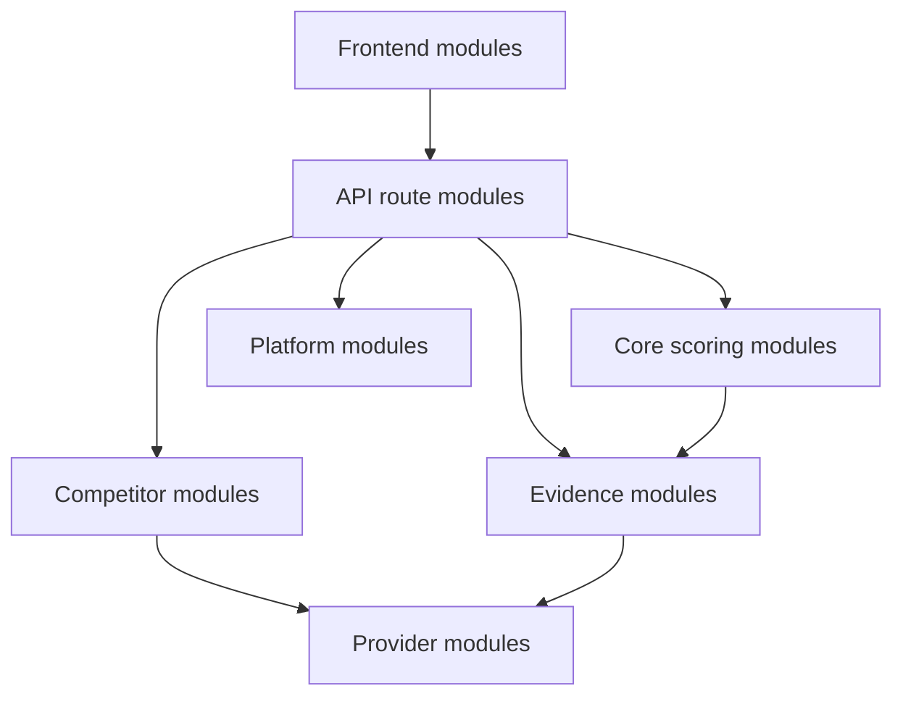

# Module Index

This map covers every runtime TypeScript/TSX module in `app/`, `components/`, and `lib/`, plus root runtime configuration.

## Application modules

- [[04-Modules/Frontend Modules|Frontend Modules]] — pages, layout, and report UI
- [[04-Modules/API Route Modules|API Route Modules]] — all route handlers

## Domain modules

- [[04-Modules/Core Scoring Modules|Core Scoring Modules]] — growth, reviews, and social scoring
- [[04-Modules/Evidence Modules|Evidence Modules]] — website fetch, parsing, and evidence helpers
- [[04-Modules/Competitor Modules|Competitor Modules]] — discovery, policy, classification, and threat scoring

## Infrastructure modules

- [[04-Modules/Provider Modules|Provider Modules]] — AI, Google, Firebase, and CRM adapters
- [[04-Modules/Platform Modules|Platform Modules]] — HTTP responses, limiting, diagnostics, middleware, and configuration

## Dependency direction

## Related notes

- [[01-Project/Repository Map|Repository Map]]
- [[02-Architecture/Architecture Overview|Architecture Overview]]
