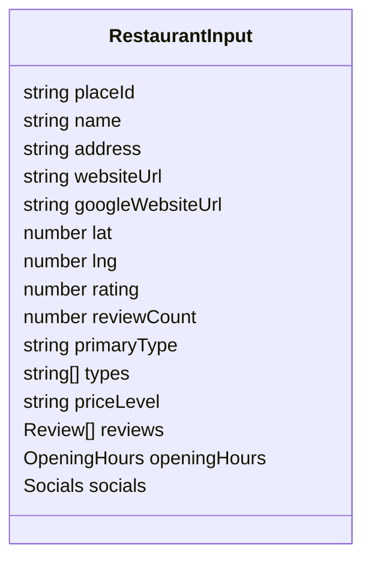

# Data Model

The project uses TypeScript types and runtime object conventions rather than a centralized schema package. The shapes below identify the stable conceptual model.

## Restaurant input

## Evidence layers

### Website inspection

Contains reachability, status/timing/size, HTML availability/source, URL/security signals, metadata, headings, schema, links, resources, performance signals, customer paths, direct-order paths, ordering classification, tracking technologies, opening hours, and PageSpeed runs.

### Brand-asset discovery

When the selected Google profile has no website, discovery may return separately sourced website and social assets. Each asset records its URL, source (`gmb`, official website, or search), verification state, confidence, and supporting evidence. A verified independent website is never copied into `googleWebsiteUrl`; this preserves the ability to report that it is missing from GMB. See [[03-Workflows/GMB Asset Gap Discovery|GMB Asset Gap Discovery]].

### Review audit

Contains provider status/source, Google baseline, normalized sample, whether responses were measurable, metrics, deterministic topic map, error, and provider diagnostics. Metrics cover sentiment distribution, response coverage, negative response, and timing.

Each review topic contains a normalized topic label, category (`product`, `service`, `experience`, or `other`), positive/negative/neutral/mixed sentiment, mention count, supporting star-rating counts, optional representative excerpts, and a confidence label based on corpus size and repetition. The topic map is unavailable for the five-item Google Places fallback sample.

### Social audit

Contains configuration state, discovered URLs, normalized profiles, provider log, and diagnostics. Each profile can hold status, followers, posts analyzed, days since last post, posting cadence, engagement, evidence confidence, and error.

### Competitor benchmark

Contains status, source, engine version, confidence, presentation eligibility, query/radius, ranked candidates, median rating/review count, ordering counts, and optional error. Candidates include business identity, geography, reputation, type/price, website, fit/substitution/threat/strength, confidence, and ordering.

## Growth result

Each `GrowthSection` contains:

| Field | Meaning |
|---|---|
| `key` | stable pillar identifier |
| `label` | owner-facing name |
| `question` | business question |
| `score` | normalized 0–100 or null |
| `weight` | contribution to overall 100 |
| `coverage` | percentage of measurable signal weight known |
| `earned` / `max` | weighted points |
| `status` | good, warning, bad, or unknown |
| `summary` | deterministic explanation |
| `evidence` | concise supporting facts |

The overall result adds `score`, `coverage`, `provisional`, `sections`, `sectionByKey`, `ordering`, and `paidMediaReadiness`.

## Interpretation

AI and fallback interpretations share an owner-facing shape including maturity stage, executive summary, primary leak, priorities, growth story, pillar summaries, strengths, review themes, journey stages, missing evidence, and confidence.

## Firestore collections

### `audits/{auditId}`

- `placeId`
- `business`
- `competitors`
- `scores`
- `report`
- `lead` — private; removed by public API
- `createdAt`

### `leads/{submissionId}` or generated document

Stores submitted lead properties plus source and capture timestamp. The second browser submission may merge `reportUrl` and `reportSummary` into the same document.

## Public projection

`GET /api/audits/{id}` returns `id`, `place_id`, `business`, `competitors`, `scores`, `report`, and `created_at`. It does not return `lead`.

## Related notes

- [[05-APIs/API Index|API Index]]
- [[08-Operations/Security and Reliability|Security and Reliability]]
