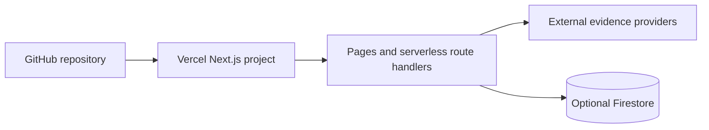

# Deployment

## Target platform

The repository is designed as one Vercel Next.js project. The Git remote is `tossdownadmin/growthaudit`; deployment configuration does not prove which Vercel project/domain is active.

## Deployment topology

## Configuration

- Vercel framework: Next.js
- build output: `.next`
- clean URLs: enabled
- trailing slash: disabled
- main audit timeout declaration: 120 seconds
- competitor route timeout declaration: 120 seconds
- social discovery: 30 seconds; independent website and social discovery calls run concurrently within that budget
- competitor policy explicitly included in output-file tracing

> [!important]
> The Vercel plan must support the declared function duration, otherwise platform limits may terminate long audits earlier.

## Build reliability

The app must not depend on fetching Google Fonts during `next build`. Typography uses a local system stack so a Vercel build remains reliable when external font hosts are unavailable.

## pnpm supply-chain policy

Vercel installs dependencies with pnpm. Approved install scripts are kept in the committed `pnpm-workspace.yaml` `allowBuilds` map. The project currently permits only `protobufjs@7.6.5`, a transitive Firebase dependency required by the installed dependency graph. Do not use a global “allow all builds” switch; review and add a package explicitly when pnpm reports a new ignored build.

## Release process

1. Make changes on a feature branch.
2. Run type-check, build, and relevant smoke tests.
3. Review configuration and provider diagnostics.
4. Open and review a pull request into `main`.
5. Merge only after approval.
6. Let Vercel build the Git commit.
7. Run the production smoke test.

This documentation change is intentionally local on `feature/my-update`; it does not authorize a push or deployment.

## Environment setup

Configure variables separately for Development, Preview, and Production. After the first deployment, set `NEXT_PUBLIC_BASE_URL` to the canonical HTTPS domain and redeploy. Vercel's `VERCEL_URL` is the automatic fallback for the internal competitor call.

## Health checks

- `/` loads without server errors.
- `/api/places/autocomplete?input=test` confirms Google configuration.
- `/api/social/check` confirms SocialCrawl key presence without exposing it.
- a complete audit returns provider diagnostics.
- a known persisted `/r/{id}` renders with metadata.

## Rollback

Use Vercel's previous deployment promotion/rollback workflow or revert the Git change through a new reviewed commit. Do not rewrite shared `main` history.

## Related notes

- [[09-Reference/Environment Variables|Environment Variables]]
- [[08-Operations/Security and Reliability|Security and Reliability]]
